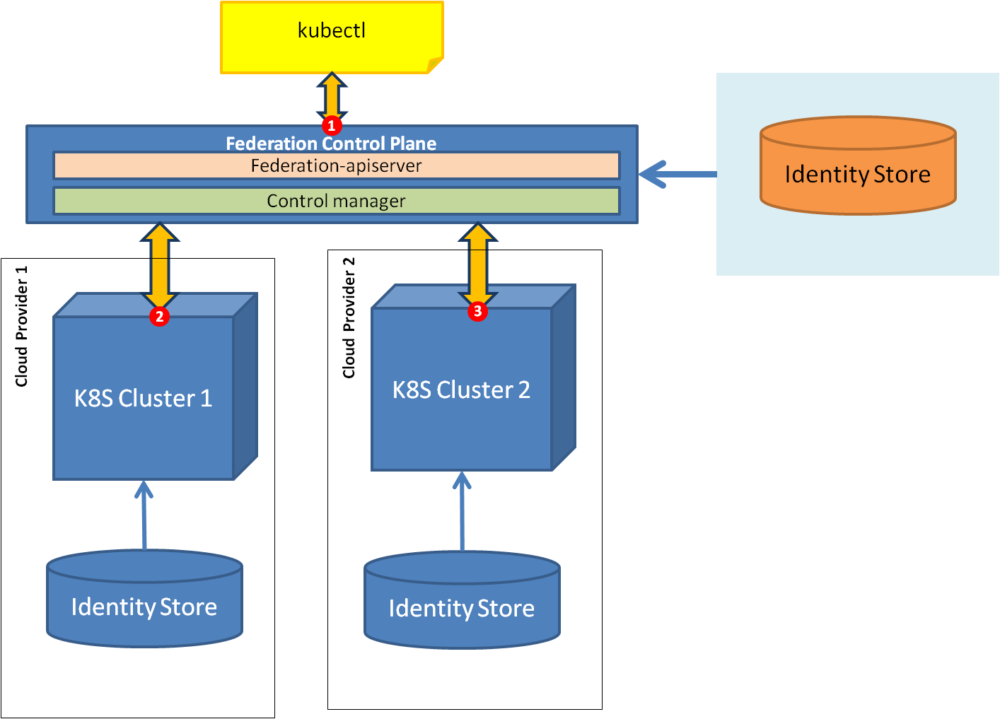
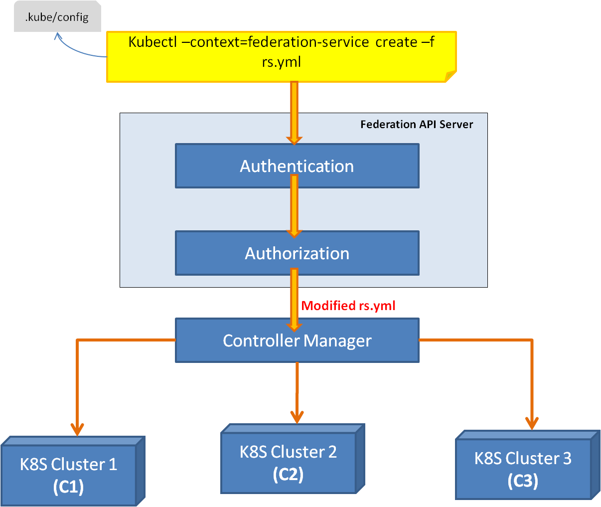
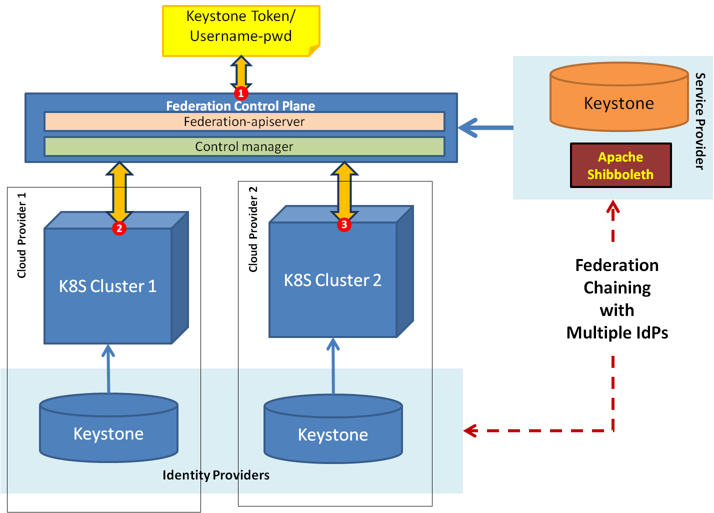

<!-- BEGIN MUNGE: UNVERSIONED_WARNING -->

<!-- BEGIN STRIP_FOR_RELEASE -->

<h2>PLEASE NOTE: This document applies to the HEAD of the source tree</h2>

If you are using a released version of Kubernetes, you should
refer to the docs that go with that version.

<!-- TAG RELEASE_LINK, added by the munger automatically -->
<strong>
The latest release of this document can be found
[here](http://releases.k8s.io/release-1.4/docs/design/federation-phase-1.md).

Documentation for other releases can be found at
[releases.k8s.io](http://releases.k8s.io).
</strong>
--

<!-- END STRIP_FOR_RELEASE -->

<!-- END MUNGE: UNVERSIONED_WARNING -->

# Ubernetes Federation Security

Author: Karun Chennuri (karun.chennuri@huawei.com)

## INTRODUCTION

In this document we propose a design for the “Security at Ubernetes level (Federation Control Plane)”. For background of the federation please refer to [this proposal] (../../docs/proposals/federation.md) & [this design] (../../docs/design/federation-phase-1.md). 

This document outlines -

* List of scenarios and use cases that motivate ubernetes security.
* Usecases that drive the design and also verifies the design.
* List of functional requirements derived from the use cases.
* Proposed architecture, API and building blocks.
* Various activity flows how the build blocks work together to support use cases.

## REQUIREMENTS

+ **Ubernetes Authentication:** Authenticate users using certificate, token files or against identity stores running external to the Ubernetes.
+ **Ubernetes Authorization:** Role Based Access Control (RBAC) user operations using 
+ **Cluster-level Authentication:** Per user based authentication on the underlying cluster. User of FCP should be uniquely identifiable in the cluster level.
+ **Cluster-level Authorization:** Per user based authorization on the underlying cluster. User of FCP should be authorized at the cluster level before allowing user to perform an operation.
+ **Federation of user identities:** 
+ **Federation of Role mapping:** Roles of ubernetes level should be mapped to roles of cluster level, before authorization takes place at the cluster level.
+ **Sensitive workloads:** Some workloads can only run on a particular cluster. They cannot be scheduled to or migrated to other clusters. 

Following are the functional requirements that's derived from above use cases.
+ User identities created on federation control plane level. User identities if not created at the FCP, should federate to the underlying cluster level IAM, provided cluster IAM is open for federation.
+ Role Based Access Control based on resource objects is done at the FCP level.
	+ Role having an access to cluster or not is decided at the FCP level.
	+ Annotation based filtering of configuration for Controller Manager.
+ User of FCP uniquely identified at the cluster level for auditing.
+ Client should be provisioned to map roles of FCP to roles of underlying clusters. Such that, accidental role escalation at the FCP level for underlying clusters is captured at the design phase and alerted to the client for appropriate corrective action while configuring RBAC rules.

## SCOPE

Federation is a broad concept, it is not possible to have one design that fits all requirements. Hence we will be proposing here multiple design approaches that meet all or subset of requirements. Idea is to support all the approaches in federation level, so that end users have the option of chosing the right approach that fit their needs. 

+	Authentication at FCP level --> Client call is authenticated at FCP level
+	Authentication at K8S cluster level --> FCP call is authenticated at K8S level
+	Authorization at FCP level --> client call is authorized at FCP level before processing requests on underlying clusters
+	Authorization at K8S cluster level --> FCP call is authorized at K8S level

## ASSUMPTIONS

Following assumptions have been made for the design. Any challenge to the below assumptions would affect the design and to be reworked.
So it's important to verify whether they are safe assumptions or not.
* Clusters running on different cloud providers manage their own IAM activities.
* Underlying kubernetes cluster that are geographically seperated has authorization mechanism based on RBAC done at cluster level.
* (for only certain design approaches) Cluster level authentication is based on Keystone.

## ARCHITECTURE

### APPROACH 1
In approach 1 we have a separate identity store at the FCP level. 

+	Replicate RBAC of Kubernetes at Ubernetes level but with identity store at federation level.
+	Federation-apiserver shall run with –authorization-mode=”RBAC”
+	Controller manager get’s a modified yaml file with annotations containing weight of only those clusters that user has access to. 
+	Controller manager may use common credentials for performing cluster level operations or use impersonation mechanism for performing cluster level operations.

<table style="border:1px solid #000000;border-collapse:collapse;">
<tbody>
<tr>
<td style="padding:5px;"><b>User</b> 
</td>
<td style="padding:5px;"><b>Roles</b> 
</td>
<td style="padding:5px;"><b>Access To Clusters</b> 
</td>
<td style="padding:5px;"><b>Original YAML</b> 
</td>
<td style="padding:5px;"><b>Modified YAML</b> 
</td>
</tr>
<tr>
<td style="padding:5px;">User 1 
</td>
<td style="padding:5px;">Role 1 
</td>
<td style="padding:5px;">C1, C3 
</td>
<td style="padding:5px;">metadata: 
  annotations: 
    federation.kubernetes.io/replica-set-preferences  
    { 
       “rebalance”: false, 
       “clusters”: { 
       <b> “c1”: {weight:1}, 
        “c2”: {weight:1}, 
        “c3”: { weight:1}</b> 
      } 
   } 
spec: 
   replicas: 4 
 
</td>
<td style="padding:5px;">metadata: 
  annotations: 
    federation.kubernetes.io/replica-set-preferences  
    { 
       “rebalance”: false, 
       “clusters”: { 
       <b> “c1”: {weight:1}, 
        “c3”: { weight:1} </b> 
      }
   }
spec: 
   replicas: 4 
 
</td>
</tr>

<tr>
<td style="padding:5px;">User 2 
</td>
<td style="padding:5px;">Role 2 
</td>
<td style="padding:5px;">C2 
</td>
<td style="padding:5px;">metadata: 
  annotations: 
    federation.kubernetes.io/replica-set-preferences  
    { 
       “rebalance”: false, 
       “clusters”: { 
        <b>“c1”: {weight:1}, 
        “c2”: {weight:1}, 
        “c3”: { weight:1}</b> 
      } 
   } 
spec: 
   replicas: 4 

 
</td>
<td style="padding:5px;">metadata: 
  annotations: 
    federation.kubernetes.io/replica-set-preferences  
    { 
       “rebalance”: false, 
       “clusters”: { 
        <b>“c2”: {weight:1}</b> 
      } 
   } 
spec: 
   replicas: 4 

 
</td>
</tr>

<tr>
<td style="padding:5px;">User 3 
</td>
<td style="padding:5px;">Role 1, Role 2 
</td>
<td style="padding:5px;">C1, C2, C3 
</td>
<td style="padding:5px;">metadata: 
  annotations: 
    federation.kubernetes.io/replica-set-preferences  
    { 
       “rebalance”: false, 
       “clusters”: { 
       <b> “c1”: {weight:1}, 
        “c2”: {weight:1}, 
        “c3”: { weight:1}</b> 
      } 
   } 
spec: 
   replicas: 4 

 
</td>
<td style="padding:5px;">metadata: 
  annotations: 
    federation.kubernetes.io/replica-set-preferences  
    { 
       “rebalance”: false, 
       “clusters”: { 
       <b> “c1”: {weight:1}, 
        “c2”: {weight:1}, 
        “c3”: { weight:1}</b> 
      } 
   }
spec: 
   replicas: 4 

 
</td>
</tr>

</tbody>
</table>

### APPROACH 2
Keystone 2 Keystone federation

++	Authentication Flow:
+	Users of FCP, each k8s cluster to be stored in Keystone (IdP side)
+	User or client application to talk to FCP same as any client talking to k8s cluster.
		+	Client uses username password to talk to FCP
		+	FCP authenticates against Keystone (SP), which in turn federates the authentication to underlying k8s cluster level Keystone (IdP)
		+	Keystone (SP) may or may not have identities stored. 
		+	Keystone should run alongside Apache Shibboleth, which has all the IdPs configured.

++	Authorization Flow:
+	The design will be same as what has been adapted for Kubernetes Authorization. 
+	Kubernetes Authorization steps:
	+	4 roles of RBAC in cluster – Role, RoleBinding, Cluster, ClusterRoleBinding – are out-of-box from Kubernetes.
	+	RBAC Role-Rules are applied at the cluster level during boot strapping phase.
	+	In Keystone create same set of 4 roles and users of Kubernetes are grouped into these roles.
	+	User is first authenticated at the apiserver level. Api server talks to Keystone with username and password, up on successful authentication Keystone returns a scoped token, which contains role information. Role here would be atleast one role of the 4 roles defined above.
+	Ubernetes Authorization steps:
	+	Create same set of roles but role-rule to be applied at the ubernetes level during boot strapping phase.
	+	Only resource object at the Ubernetes level is “Cluster”. So the rules shall be applied only on “Cluster” resource for different roles. Rest of the steps as-is as Kubernetes.

